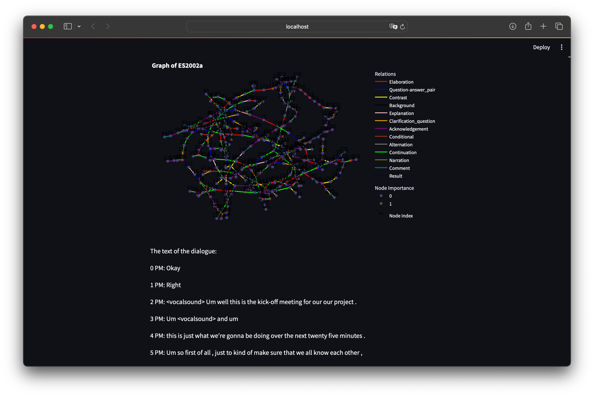

# X-INF554 Kaggle Data Challenge

Data challenge held by [LIX, École polytechnique](https://www.lix.polytechnique.fr), as the final project of course INF554 - Apprentissage Automatique et Profond (2023-2024).

Topic: [Extractive Summarization with Discourse Graphs](https://www.kaggle.com/competitions/inf554-extractive-summarization-2023/overview)

Team: GWG

Members: Chenwei WAN (DATAAI), Xianjin GONG (IGD), Mengfei GAO (IGD)

Our final ranking: 5/65

Read our [technical report](https://github.com/cw-wan/X-INF554-DataChallenge-GWG/blob/master/report.pdf)

## Before starting

Install required packages in `/requirements.txt`. We recommend to use PyTorch with Cuda.

## How to run interactive dialogue graph visualization

Make sure the raw [data](https://www.kaggle.com/competitions/inf554-extractive-summarization-2023/data) is placed under `/data`

Simply run command:

```bash
streamlit run graph.py
```



## How to use with pre-computed embeddings

Download utterance embeddings pre-computed by our tuned RoBERTa-large model:

| Binary Package                                                                                     | Size    |
|----------------------------------------------------------------------------------------------------|---------|
| [Train-dev](https://drive.google.com/file/d/1RY5aRUCezixco-Xy1rBVMjORnoIPuPLH/view?usp=drive_link) | 284.6MB |
| [Test](https://drive.google.com/file/d/13WViF-bhfJd69fGw_wkuktrpiu8yF4nq/view?usp=drive_link)      | 121.6MB |

Put these two `.pkl` files under `data/encoding`.

For different ways of incorporating speaker information, see `configs/pre_encoded_gcn_config.py`.

Run the following command for cross-validation:

```bash
python main.py -s pre-encoded-gcn -m train
```

For testing and producing the output file:

```bash
python main.py -s pre-encoded-gcn -m test
```

The model will firstly be trained on the whole training data and then make predictions on the test set. The output file
can be found under `/output`.

## How to tune RoBERTa-large

Put raw data including utterances, graph edges and training labels under `data/`.

Download [RoBERTa-large](https://huggingface.co/roberta-large/tree/main) and put the files
under `modules/roberta-large`.

Run the following command to perform cross-validation (optional):

```bash
python main.py -m tune
```

Run the following command to tune RoBERTa-large for specified epochs (8 for example) and compute utterance embeddings
saved as binary packages:

```bash
python main.py -m compute -e 8
```
